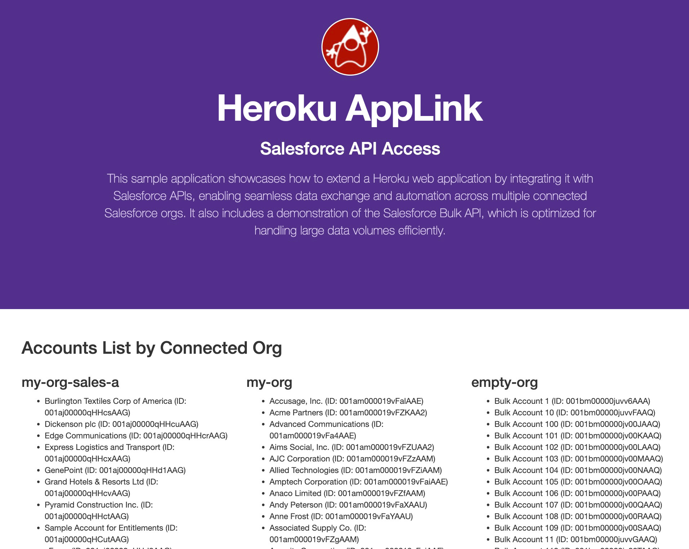

Heroku AppLink - Salesforce API Access (Java)
=============================================

# Architecture Overview

This sample application showcases how to extend a Heroku web application by integrating it with Salesforce APIs, enabling seamless data exchange and automation across multiple connected Salesforce orgs. It also includes a demonstration of the Salesforce Bulk API, which is optimized for handling large data volumes efficiently.



# Requirements
- Heroku login
- Heroku AppLink enabled
- Heroku CLI installed
- Heroku AppLink CLI plugin is installed
- Salesforce CLI installed
- Login information for one or more Scratch, Development or Sandbox orgs

Local Development and Testing
-----------------------------

You do not need to deploy your application but you do need to configure it with Heroku.

```
heroku create
heroku addons:create heroku-applink --wait
heroku salesforce:authorizations:add my-org
heroku config:set CONNECTION_NAMES=my-org
heroku config:set HEROKU_APP_ID="$(heroku apps:info --json | jq -r '.app.id')"
heroku config --shell > .env
mvn clean install
mvn spring-boot:run
```

Navigate to `https://localhost:5000` to observe a list of accounts from the connected org.

**Multiple Org Connections**

To access multiple Salesforce orgs, repeat the `salesforce:authorizations` command above with different org logins and connection names, then update the `CONNECTION_NAMES` environment variable within the `.env` file with a comma delimiated list of connection names (example shown below). The sample code will automatically query for `Account` in each org and display the results.

```
CONNECTION_NAMES=my-org,my-org-sales-a
```

**Bulk API Inserts**

This sample includes a demonstration of using the Salesforce Bulk API using connections formed with Heroku AppLink. To see this in action obtain an org that is empty or that you are using for testing purposes only. Repeat the `salesforce:authorizations` command above using the connection name `empty-org` and then update the `CONNECTION_NAMES` environment variable within `.env` with a comma delimiated list of connection names (example shown above). Restart the application using the `mvn spring-boot:run` command and you will see in the console output the following: 

```
Starting Bulk API process for 'empty-org'
Created Bulk API job: 750bm00000GtITrAAN
Submitted batch: 751bm00000CaqKYAAZ
Batch 751bm00000CavSKAAZ - State: Queued
Batch 751bm00000CavSKAAZ - State: InProgress
Batch 751bm00000CavSKAAZ - State: Completed
Batch processing complete.
```

Once the processing has complete refresh `https://localhost:5000` to observe the records that have been bulkloaded. Note to avoid duplicate inserts the sample code checks if prior bulk inserts have been run each time the application starts. To reset the Bulk API part of this sample run the following Apex code from the `sf` command line (example assumes `empty-org` is also a known `sf` CLI authorized org alias).

```
   echo "delete [SELECT Id FROM Account WHERE Name LIKE 'Bulk Account%'];" | sf apex run -o empty-org
```

Deploy to Heroku
----------------

```
heroku create
heroku addons:create heroku-applink --wait
heroku salesforce:authorizations:add my-org
heroku config:set CONNECTION_NAMES=my-org
heroku config:set HEROKU_APP_ID="$(heroku apps:info --json | jq -r '.app.id')"
git push heroku main
heroku open
```

To access multiple Salesforce orgs, repeat the `salesforce:authorizations` command above with different org logins and connection names, then update the `CONNECTION_NAMES` with a comma delimiated list of connection names. The sample code will automatically query for `Account` in each org and display the results.

Technical Information
---------------------
- Salesforce APIs are always accessed in the context of the authenticated user defined at the time of authentication. This means that only the objects and fields the user has access to can be accessed by the code. This sample uses only a subset of the Salesforce APIs available.
- This is a [Java Spring Boot](https://spring.io/projects/spring-boot) application, using [Thymeleaf](https://www.thymeleaf.org/) to render browser content. Other client libraries and frameworks can be used of course.
- The Java class `BasicAPIAccessApplication.java` contains the `index` method that queries the org/s using **SOQL** and injects the record data into the Thymeleaf template `index.html` that renders the default page.

        QueryResult result = salesforceClient.getConnection().query("SELECT Name, Id FROM Account");
- The Java class `SalesforceClient.java` reads the environment variables supplied by the **Heroku AppLink** add-on and constructs a connection class for each Salesforce org. You can see environment variables by running the command `heroku config`. This boiler plate code will be replaced in future releases with an SDK for Java provided by Heroku.
- The [Salesforce WSC Java client]() for Salesforce APIs is used for the pilot, however in future releases Heroku will provide additional SDK support.
- This is a [Java Spring Boot](https://spring.io/projects/spring-boot) application, using [Thymeleaf](https://www.thymeleaf.org/) to render browser content. Other client libraries and frameworks can be used of course.
- This sample uses a custom environment variable `CONNETION_NAMES` to enumerate the org connections to be used by the applicaiton. However this could easily be hardcoded in your own library code, or obtained from a configuration service or other preffered means of your choice.

Other Samples
-------------

| Sample | What it covers? |
| ------ | --------------- |
| [Salesforce API Access - Java](https://github.com/heroku-examples/heroku-applink-pattern-api-access-java) | This sample application showcases how to extend a Heroku web application by integrating it with Salesforce APIs, enabling seamless data exchange and automation across multiple connected Salesforce orgs. It also includes a demonstration of the Salesforce Bulk API, which is optimized for handling large data volumes efficiently. |
| [Extending Apex, Flow and Agentforce - Java](https://github.com/heroku-examples/heroku-applink-pattern-org-action-java) | This sample demonstrates importing a Heroku application into an org to enable Apex, Flow, and Agentforce to call out to Heroku. For Apex, both synchronous and asynchronous invocation are demonstrated, along with securely elevating Salesforce permissions for processing that requires additional object or field access. |
| [Scaling Batch Jobs with Heroku - Java](https://github.com/heroku-examples/heroku-applink-pattern-org-job-java) | This sample seamlessly delegates the processing of large amounts of data with significant compute requirements to Heroku Worker processes. It also demonstrates the use of the Unit of Work aspect of the SDK (JavaScript only for the pilot) for easier utilization of the Salesforce Composite APIs. |
| [Using Eventing to drive Automation and Communication](https://github.com/heroku-examples/heroku-applink-pattern-eventing-java) | This sample extends the batch job sample by adding the ability to use eventing to start the work and notify users once it completes using Custom Notifications. These notifications are sent to the user's desktop or mobile device running Salesforce Mobile. Flow is used in this sample to demonstrate how processing can be handed off to low-code tools such as Flow. |
